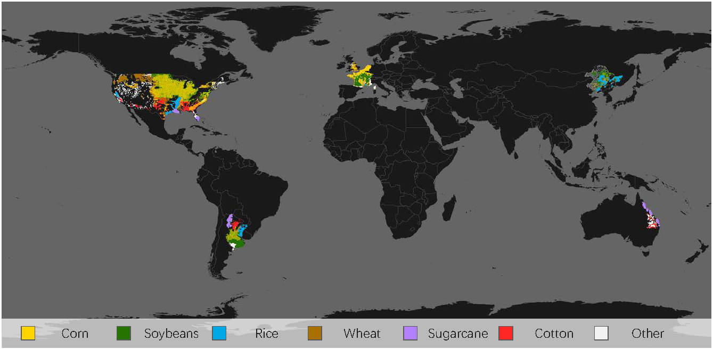
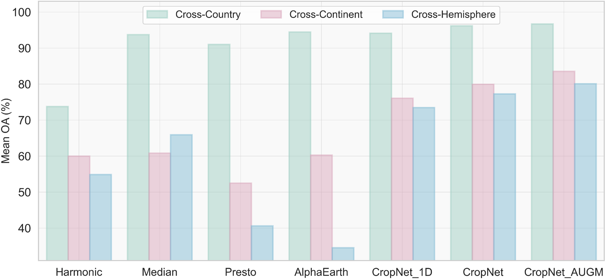

# Invariant Features for Global Crop Type Classification [[arXiv](https://arxiv.org/abs/2509.03497)]


### Overview

This repository contains code and data links for our study on **cross-region crop type classification**.  
The paper systematically investigates which remote sensing representations transfer best across countries, continents, and hemispheres.

---

### CropGlobe Benchmark

<p align="center">
  
</p>

CropGlobe contains more than 300,000 samples from Argentina, Australia, Belgium, China, France, the Netherlands, the United Kingdom, and the United States.

**CropGlobe can be accessed here:**

Raw Satellite Data: [[Google Drive](https://drive.google.com/drive/folders/1cgWrMNCjbPAkpb59h9xQ58xZMoaNx3rY?usp=sharing)]

Packaged Dataset: [[Hugging Face](https://huggingface.co/datasets/x-ytong/CropGlobe)]

---

### Result Summary

<p align="center">
  
</p>

The figure compares OA of harmonic features, temporal median features, geospatial foundation model embeddings ([[Presto](https://arxiv.org/abs/2304.14065)] and [[AlphaEarth](https://arxiv.org/abs/2507.22291)]), and our proposed CropNet with augmentation approach.

---

### Usage

Install the required packages with:

```bash
pip install -r requirements.txt
```

Download the processed CropGlobe dataset from Hugging Face with:

```bash
from huggingface_hub import snapshot_download

local_dir = snapshot_download(
    repo_id="x-ytong/CropGlobe",
    repo_type="dataset",
    local_dir="./*your data path/CropGlobe",
)
```

This repository provides two main scripts:

### 1. `run_CropNet_AUGM.py`

This script trains CropNet on temporal median features with data augmentation.

```bash
python run_CropNet_AUGM.py \
  --data_dir ./*your data path/CropGlobe/for_CropNet/ \
  --output_dir ./*your output path/ \
  --source FRA \
  --targets BEL NLD GBR CHN USA ARG
```

### 2. `run_comparison.py`

This script evaluates different traditional features and geospatial foundation model embeddings.

```bash
python run_comparison.py \
  --data_dir ./*your data path/CropGlobe/Harmonic/ \
  --output_dir ./*your output path/ \
  --fea_type Harmonic \
  --classifier MLP \
  --source FRA \
  --targets BEL NLD GBR CHN USA ARG
```

```bash
python run_comparison.py \
  --data_dir ./*your data path/CropGlobe/AlphaEarth/ \
  --output_dir ./*your output path/ \
  --fea_type AlphaEarth \
  --classifier RF \
  --source FRA \
  --targets BEL NLD GBR CHN USA ARG
```

---

### Paper

If you use this repository, please cite the paper:

> Xin-Yi Tong and Sherrie Wang.  
> **Invariant Features for Global Crop Type Classification**.  
> arXiv preprint arXiv:2509.03497, 2025.  
> [https://arxiv.org/abs/2509.03497](https://arxiv.org/abs/2509.03497)

---


